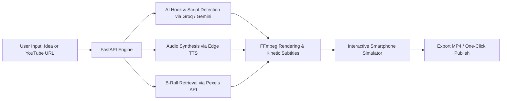

# 🎬 Shorts Studio — AI-Assisted Short-Form Video Platform

[](https://github.com/alessandrooliveirape-prog/video-shorts-studio)
[](LICENSE)
[](https://react.dev/)
[](https://www.typescriptlang.org/)
[](https://fastapi.tiangolo.com/)
[](https://ffmpeg.org/)
[](https://groq.com/)

> **Live Application Demo:** [https://video-shorts-studio.vercel.app](https://video-shorts-studio.vercel.app)

An end-to-end full-stack platform designed to automate short-form video creation (YouTube Shorts, TikTok, Instagram Reels) using generative AI, video clipping algorithms, and hardware-accelerated FFmpeg rendering.

---

## 🌟 Key Highlights & Architecture

Shorts Studio bridges generative language models with programmatic video composition to turn long-form YouTube videos or text prompts into high-engagement 9:16 vertical videos.



### 1. 🔹 Intelligent YouTube Video Clipping
* **Automated Viral Hook Detection:** Ingests any public video URL, processes audio transcripts, and identifies peak engagement segments using LLM semantic scoring.
* **Precision 9:16 Re-framing:** Automatically crops 16:9 widescreen footage into centered 9:16 vertical shorts via dynamic FFmpeg filters.
* **Stream Extraction:** Integrated with `yt-dlp` for resilient video streaming without local storage overhead.

### 2. 🔹 Studio "From Scratch" (Automated Generative Production)
* **Script Generation:** Produces a structured 30-second, 5-scene narrative sequence from a single prompt using **Groq (Llama-3.3-70B)**.
* **Algorithmic Composition:** Renders dynamic background motion gradients, Ken Burns zoom/pan effects, and kinetic subtitles using FFmpeg's `drawtext` and filter graphs.
* **Voice Synthesis:** Integrated edge voice generation with automated subtitle timestamp alignment.

### 3. 🔹 Modern Glassmorphic UI & Interactive Simulator
* **Interactive Smartphone Viewport:** Real-time 9:16 mobile canvas simulation with responsive playback controls.
* **Design System:** Dark glassmorphism built with React 19, Tailwind CSS, Lucide icons, and Framer Motion transitions.

---

## 🛠️ Tech Stack

| Layer | Technologies |
|---|---|
| **Frontend** | React 19, TypeScript, Vite 6, Tailwind CSS 4, Motion, Lucide React |
| **Backend API** | Python 3.10+, FastAPI, Uvicorn, Pydantic |
| **AI & NLP** | Groq Cloud API (Llama 3.3 70B Versatile), Google Gemini API |
| **Media Processing** | FFmpeg, `yt-dlp`, Edge TTS, Pexels API |
| **Deployment** | Vercel (Frontend SPA), Render / Docker (Media Processing Backend) |

---

## 🚀 Getting Started

### Prerequisites
* **Node.js** 18+ and **npm**
* **Python** 3.10+
* **FFmpeg** installed and accessible in your system `PATH`

### 1. Clone the Repository
```bash
git clone https://github.com/alessandrooliveirape-prog/video-shorts-studio.git
cd video-shorts-studio/video-shorts-studio
```

### 2. Configure Environment Variables
Copy the example environment file:
```bash
cp ../.env.example .env
```
Fill in your API keys (optional: app can also run in simulated mode without active keys):
```env
GROQ_API_KEY="your-groq-api-key"
PEXELS_API_KEY="your-pexels-api-key"
```

### 3. Install & Start Frontend
```bash
npm install
npm run dev
```
The client will start at `http://localhost:3000`.

### 4. Install & Start Backend
```bash
cd backend
python -m venv venv
# On Windows:
.\venv\Scripts\activate
# On Linux/macOS:
source venv/bin/activate

pip install -r requirements.txt
python -m uvicorn fastapi_backend:app --reload --port 8000
```
Backend API will be accessible at `http://localhost:8000/docs`.

---

## 🔒 Security & Safe Execution
* **Zero Hardcoded Secrets:** All API keys and connection tokens are loaded strictly via environment variables.
* **Non-Persistent Cache:** Downloaded clips and temporary render streams are automatically pruned after processing.
* **Safe Sandbox:** Video processing runs within isolated execution blocks with execution timeouts.

---

## 👤 Author & Status
* **Author:** [Alessandro Oliveira](https://github.com/alessandrooliveirape-prog)
* **Status:** Independent Project
* **License:** [MIT License](LICENSE)
